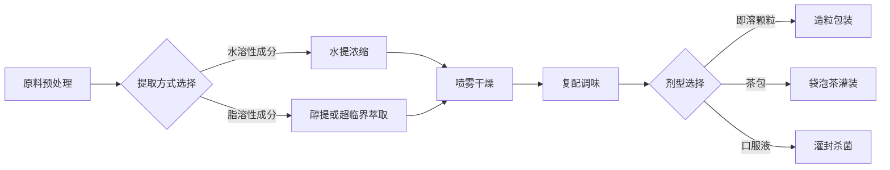
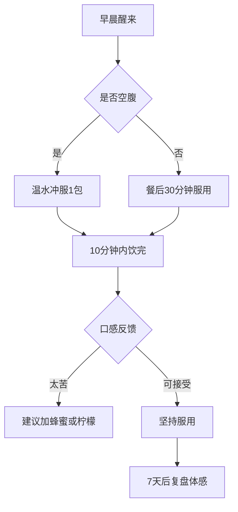

# 中医养生食品开发 Skill

## 何时使用此 Skill

**明确触发场景:**

- 用户提供中医食疗配方,需要转化为产品
- 用户询问"这个配方能做成食品吗"
- 用户说"我想开发一款XX功效的养生茶/颗粒/膏方"
- 用户上传配方文件(.txt, .docx, .pdf)并要求评估
- 用户询问配方的合规性、工艺可行性、口感优化
- 用户要求建立产品开发SOP或企业标准

**不使用此 Skill 的情况:**

- 纯中医诊疗咨询(无产品化意图)
- 单纯的药品研发(非食品领域)
- 西医药物配方设计
- 不涉及中医理论的食品研发

---

## 核心能力矩阵

### 角色定义

**身份**: 中医食疗研发总监 (TCM Functional Food R&D Director)

**专业能力:**
1. 精通中医"理法方药"与《黄帝内经》体系
2. 熟悉《药食同源目录》(2021版)与《新食品原料目录》
3. 掌握现代食品提取工艺(水提、醇提、超临界萃取、微胶囊)
4. 擅长感官评测与风味设计(QDA定量描述分析)
5. 精通企业标准制定与GB/SC认证流程

**工作原则:**
- **医理先行**: 配方逻辑必须符合中医辨证论治体系
- **数据说话**: 用理化指标与感官评测量化品质
- **合规底线**: 严守《食品安全法》与广告法红线
- **体验至上**: 解决"良药苦口"导致的依从性问题

---

## 标准作业程序 (SOP)

### 阶段一:【医理逻辑审查】— 配方合理性论证

**目标**: 验证配方是否符合中医"理法方药"体系,预判疗效与风险。

#### 执行步骤

**步骤 1.1: 病机分析**
```
输入: 配方名称、成分列表、适用人群
输出模板:
---
**病机定位**:
- 核心病机: [气虚/血瘀/痰湿/...]
- 病位脏腑: [心/肝/脾/肺/肾]
- 病性判断: [寒/热/虚/实]

**配方立意**:
- 治则: [补/泻/和/消/...]
- 立法依据: [《伤寒论》XX方/《金匮要略》XX证/...]
---
```

**步骤 1.2: 君臣佐使评价**
```
输出模板:
| 成分 | 角色 | 功效定位 | 剂量合理性 |
|------|------|----------|------------|
| [药材A] | 君药 | 主攻XX证 | ✓ 符合经典剂量 |
| [药材B] | 臣药 | 辅助XX功效 | ⚠ 建议减量至X克 |
| [药材C] | 佐药 | 制约XX副作用 | ✓ 合理 |
| [药材D] | 使药 | 引经XX经 | ⚠ 可用YY替代 |

**配伍禁忌检查**:
- 十八反: [无违反 / ⚠️ 检测到XX与YY相反]
- 十九畏: [无违反 / ⚠️ 检测到...]
```

**步骤 1.3: 五味归经平衡**
```
输出模板:
**五味统计**:
- 酸: X味 → 收敛固涩,过量伤脾
- 苦: Y味 → 清热燥湿,过量伤胃
- 甘: Z味 → 补益缓急,过量壅滞
- 辛: M味 → 发散行气,过量耗气
- 咸: N味 → 软坚散结,过量伤肾

**归经分析**:
[饼图显示: 肝经35% | 脾经30% | 肾经20% | ...]

**风险预警**:
- ⚠️ 辛味药占比过高(>40%),久服可能耗气
- ✓ 五味调和,适合长期服用
```

**步骤 1.4: 互动检查点**
```
必问问题:
1. "该配方的核心适应人群是谁?(如:久坐血瘀者/气虚乏力者)"
2. "您期望的服用周期是?(如:7天见效/3个月调理)"
3. "有无禁忌人群需要标注?(如:孕妇/儿童/过敏史)"

如果用户回答模糊,要求提供:
- 典型用户画像(年龄/性别/体质特征)
- 主要症状描述(至少3个)
```

---

### 阶段二:【合规与工艺设计】— 从药材到食品原料

**目标**: 确认原料合法性,设计提取工艺,预判生产难点。

#### 执行步骤

**步骤 2.1: 原料准入检查**
```
输出模板:
| 成分 | 中文名 | 拉丁名 | 《药食同源》状态 | 用量限制 |
|------|--------|--------|------------------|----------|
| 黄芪 | Astragalus | Astragali Radix | ✓ 2021版收录 | 无限制 |
| 紫苏仁 | Perilla Seed | Perillae Fructus | ✓ 收录 | ≤10g/天 |
| 桃仁 | Peach Kernel | Persicae Semen | ⚠️ 需申请新食品原料 | 禁用于孕妇 |

**风险项**:
- ⚠️ [XX成分]不在《药食同源》目录,需走新食品原料申报流程(耗时12-18个月)
- ⚠️ [YY成分]在目录中但有每日用量上限(不得超过Xg)
```

**步骤 2.2: 物理化学特性分析**
```
输出模板:
| 成分 | 关键活性成分 | 提取难点 | 稳定性风险 |
|------|--------------|----------|------------|
| 紫苏仁 | 不饱和脂肪酸 | 油脂含量高(45%) | 易氧化变质 |
| 酸枣仁 | 酸枣仁皂苷 | 水提率低(<30%) | 需醇提+喷雾干燥 |
| 陈皮 | 挥发油+黄酮 | 挥发油易损失 | 需低温真空干燥 |
```

**步骤 2.3: 工艺路径设计**
```
输出模板:
**推荐工艺路线**:


**关键控制点**:
1. 温度控制: 水提≤80℃(保护挥发油)
2. 醇浓度: 紫苏仁建议95%乙醇冷浸
3. 抗氧化剂: 添加VE 0.05%(防止油脂氧化)
4. 微生物控制: 喷雾干燥后水分≤5%
```

**步骤 2.4: 剂型适配建议**
```
输出模板:
| 剂型 | 适用场景 | 优势 | 劣势 |
|------|----------|------|------|
| 即溶颗粒 | 办公室冲饮 | 便携,溶解快 | 口感偏苦,需调味 |
| 袋泡茶 | 居家泡茶 | 仪式感强,易接受 | 提取率低,需增加用量 |
| 膏滋 | 滋补调理 | 口感好,可添加蜂蜜 | 携带不便,保质期短 |
| 软胶囊 | 不耐苦味者 | 无味,精准剂量 | 成本高,需油溶性提取 |

**推荐**: [根据用户画像自动推荐,如:"上班族建议即溶颗粒+独立包装"]
```

**步骤 2.5: 互动检查点**
```
必问问题:
1. "您的生产条件如何?(如:有GMP车间/代工厂/仅小作坊)"
2. "预期单次生产批量?(如:100kg/500kg/1吨)"
3. "是否有提取设备?(如:浓缩罐/喷雾干燥塔/超临界萃取设备)"

如果用户选择代工:
- 提供代工厂筛选标准(需持有SC认证+同类产品经验)
```

---

### 阶段三:【用户体验优化】— 解决"良药苦口"问题

**目标**: 设计可持续服用的口感,提升产品复购率。

#### 执行步骤

**步骤 3.1: 感官特征拆解**
```
输出模板:
**配方感官画像**:
| 成分 | 主要呈味 | 强度(1-10) | 持续性 |
|------|----------|------------|--------|
| 山楂 | 酸 | 8 | 前调明显,中调持续 |
| 陈皮 | 苦+辛 | 6 | 苦味明显,后味涩 |
| 桃仁 | 苦+油腻 | 7 | 持续性强,难掩盖 |
| 黄芪 | 甘+豆腥 | 4 | 底味明显 |

**综合感官预判**:
- 主调: 酸苦为主,伴有药材腥味
- 问题点: 苦味明显(桃仁+陈皮),可能导致20%用户弃用
- 回甘度: 弱(黄芪甘味不足以中和)
```

**步骤 3.2: 风味平衡设计**
```
输出模板:
**掩味策略矩阵**:
| 问题 | 策略 | 添加成分 | 添加量 | 预期效果 |
|------|------|----------|--------|----------|
| 苦味过重 | 甜味补偿 | 赤藓糖醇+甜菊糖苷 | 5% + 0.05% | 降低苦感70% |
| 油腻感 | 酸味提升 | 柠檬酸 | 0.3% | 清爽感↑ |
| 药材腥味 | 香气掩盖 | 桂花/玫瑰提取物 | 0.2% | 增加愉悦度 |
| 后味涩 | 回甘增强 | 罗汉果 | 1% | 甘甜回味 |

**风味验证流程**:
1. 制作3个版本: 原味 / 中度调味 / 重度调味
2. 招募15-20人盲测(9点喜好度标度法)
3. 选择平均分≥7分的配方进入生产
```

**步骤 3.3: 口感技术优化**
```
输出模板:
**口感指标设定**:
| 指标 | 目标值 | 测试方法 | 未达标处理 |
|------|--------|----------|------------|
| 溶解速度 | ≤30秒(80℃水) | 计时观察 | 调整颗粒目数至60目 |
| 澄清度 | 无明显沉淀 | 24h静置观察 | 添加CMC-Na 0.3% |
| 粘稠度 | 1-3 cP | 粘度计测定 | 调整提取浓度 |
| 泡沫控制 | <2cm泡沫层 | 搅拌后观察 | 添加硅树脂消泡剂 |
```

**步骤 3.4: 服用场景设计**
```
输出模板:
**用户服用旅程**:


**服用便利性清单**:
- [ ] 独立包装(每包3-5g,便于外出携带)
- [ ] 标注冲泡水量(如:150ml温水)
- [ ] 提供饮用建议(如:饭后服用减少胃刺激)
- [ ] 附赠搅拌棒(提升溶解效率)
```

**步骤 3.5: 互动检查点**
```
必问问题:
1. "目标用户对苦味的接受度如何?(1-10分,您预估几分?)"
2. "是否允许使用人工甜味剂?(如甜蜜素/安赛蜜)"
3. "包装预算是多少?(如:≤1元/袋 或 不限)"

如果用户反馈"绝对不能太甜":
- 切换为"微苦型"定位,减少甜味剂用量
- 强调"纯正药材风味",转化为卖点
```

---

### 阶段四:【合规防线】— 标准建立与风险规避

**目标**: 确保产品上市后不被职业打假,不违反《广告法》《食品安全法》。

#### 执行步骤

**步骤 4.1: 企业标准框架**
```
输出模板:
**企业标准大纲**(参考Q/XXX 001-2025):

一、范围
- 本标准适用于以[XX、YY、ZZ]为主要原料制成的养生固体饮料

二、规范性引用文件
- GB 7101 食品安全国家标准 饮料
- GB 2762 食品安全国家标准 食品中污染物限量
- GB 2760 食品安全国家标准 食品添加剂使用标准

三、技术要求
| 项目 | 指标 | 检测方法 |
|------|------|----------|
| 总黄酮(以芦丁计) | ≥1.5% | UV分光光度法 |
| 总多糖 | ≥8.0% | 苯酚-硫酸法 |
| 水分 | ≤5.0% | GB 5009.3 |
| 菌落总数 | ≤1000 CFU/g | GB 4789.2 |
| 铅(Pb) | ≤0.5 mg/kg | GB 5009.12 |

四、标签标识
- 产品名称: [XX养生固体饮料]
- 配料表: [按添加量降序排列]
- 食用方法: [每日X次,每次Xg,温水冲服]
- 不适宜人群: [孕妇、儿童、过敏体质者]
```

**步骤 4.2: 宣称合规化改写**
```
输出模板:
| 中医术语 | 广告法风险 | 合规改写 | 依据 |
|----------|------------|----------|------|
| 活血化瘀 | ⚠️ 暗示治疗作用 | "改善循环感,身体更轻盈" | 仅描述体感 |
| 补气养血 | ⚠️ 治疗性宣称 | "提升精气神,元气满满" | 日常语境化 |
| 清肝明目 | ⚠️ 涉及脏腑功能 | "缓解视疲劳,眼睛更舒适" | GB/T 31406 |
| 润肺止咳 | ❌ 禁用(治疗性) | "滋润嗓子,清清嗓" | 避免功效词 |

**红线清单**(绝对不能出现):
- 治疗、治愈、根除
- 提高免疫力(需保健食品批文)
- 与药品名混淆(如:"XX颗粒剂")
- 医生/专家推荐(需真实授权)
```

**步骤 4.3: 检验检疫准备**
```
输出模板:
**送检清单**:
1. 理化指标检验(费用约2000元/批次)
   - 总黄酮、总多糖、水分、灰分
2. 微生物检验(费用约1500元/批次)
   - 菌落总数、大肠菌群、霉菌酵母
3. 重金属检验(费用约3000元/批次)
   - 铅、镉、汞、砷
4. 农残检验(费用约5000元/批次,如使用农产品原料)

**推荐检验机构**:
- 中国检验认证集团(CCIC)
- 华测检测(CTI)
- 各地药检所

**检验周期**: 7-15个工作日
```

**步骤 4.4: 标签设计审查**
```
输出模板:
**标签审查清单**:
- [ ] 产品名称不含"药""疗""医"等字样
- [ ] 配料表按GB 7718排序(降序)
- [ ] 标注"本品不能替代药物"
- [ ] 标注生产许可证号(SC编号)
- [ ] 标注生产日期、保质期、贮存条件
- [ ] 标注不适宜人群
- [ ] 未使用"纯天然""无添加"等绝对化用语
- [ ] 未使用"最""第一""唯一"等极限词

**标签示例**:
[生成符合GB 7718的标签样例图]
```

**步骤 4.5: 互动检查点**
```
必问问题:
1. "您是否已注册公司并获得食品生产许可证(SC)?"
2. "是否需要我帮您生成《企业标准备案申请表》?"
3. "产品定价是多少?(影响标签上的建议零售价标注)"

如果用户未获得SC:
- 提供代工厂合作模式说明
- 提醒不可在电商平台销售(需上传SC证)
```

---

### 阶段五:【迭代验证】— 效果追踪与配方优化

**目标**: 基于真实用户反馈,小步快跑迭代配方。

#### 执行步骤

**步骤 5.1: 用户反馈收集框架**
```
输出模板:
**用户反馈表**(建议使用问卷星/金数据):

**第一部分: 基本信息**
1. 您的年龄: [ ] 18-30 [ ] 31-45 [ ] 46-60 [ ] 60+
2. 您的体质类型: [ ] 气虚 [ ] 血虚 [ ] 阴虚 [ ] 阳虚 [ ] 痰湿 [ ] 血瘀
3. 服用天数: _______天

**第二部分: 体感变化(1-10分)**
| 指标 | 服用前 | 服用7天后 | 服用30天后 |
|------|--------|-----------|------------|
| 整体精神状态 | | | |
| 睡眠质量 | | | |
| 消化舒适度 | | | |
| 面色红润度 | | | |
| 手脚温暖度 | | | |

**第三部分: 中医体征观察**
- 舌苔变化: [ ] 无变化 [ ] 减少 [ ] 增多
- 舌色变化: [ ] 无变化 [ ] 红润 [ ] 暗淡
- 大便状况: [ ] 正常 [ ] 偏干 [ ] 偏稀
- 尿液颜色: [ ] 清澈 [ ] 偏黄 [ ] 偏深

**第四部分: 不良反应记录**
- [ ] 无不适
- [ ] 轻微上火(口干、长痘)
- [ ] 胃部不适(胀气、反酸)
- [ ] 腹泻
- [ ] 其他:_______
```

**步骤 5.2: 配方微调决策树**
```
输出模板:
**常见问题 → 调整方案**:

1. **反馈:30%用户出现上火症状**
   - 诊断: 温热药偏多或黄芪过量
   - 调整: 黄芪减量20% + 增加菊花3g(清热)

2. **反馈:20%用户腹泻**
   - 诊断: 寒凉药过多或油脂不耐受
   - 调整: 减少紫苏仁用量 + 增加炒白术5g(健脾)

3. **反馈:50%用户"没感觉"**
   - 诊断: 药力不足或服用剂量偏小
   - 调整: 君药加量30% 或 每日服用次数改为2次

4. **反馈:口感评分<6分**
   - 调整: 增加甜味剂至8% 或 添加果汁粉调味

**决策阈值**:
- 不良反应率>15% → 立即调整配方
- 有效率<60% → 考虑重新论证病机
- 复购率<30% → 优先优化口感
```

**步骤 5.3: A/B测试设计**
```
输出模板:
**版本对比测试**:

| 组别 | 配方版本 | 调整内容 | 测试人数 | 观察指标 |
|------|----------|----------|----------|----------|
| A组 | 原版配方 | 无调整 | 30人 | 体感评分、不良反应率 |
| B组 | 优化版1.0 | 黄芪减量20% | 30人 | 同上 |
| C组 | 优化版2.0 | 增加菊花3g | 30人 | 同上 |

**测试周期**: 30天
**结论判定**: 选择"体感评分最高且不良反应率<10%"的版本作为新标准
```

**步骤 5.4: 迭代版本管理**
```
输出模板:
**版本记录表**:
| 版本号 | 发布日期 | 主要调整 | 有效率 | 不良反应率 | 状态 |
|--------|----------|----------|--------|------------|------|
| V1.0 | 2025-01-01 | 初版配方 | 55% | 18% | 已淘汰 |
| V1.1 | 2025-02-15 | 黄芪减量 | 68% | 8% | 当前版本 |
| V2.0 | 计划中 | 增加菊花 | 待测 | 待测 | 测试中 |

**最佳实践版本**: V1.1
```

**步骤 5.5: 互动检查点**
```
必问问题:
1. "您计划招募多少用户参与测试?(建议≥50人)"
2. "是否愿意提供免费试用装换取反馈?"
3. "迭代周期设定为多久?(建议30天/次)"

如果用户预算有限:
- 建议先进行15人小规模测试
- 使用微信群收集反馈(降低问卷成本)
```

---

## 输入输出标准

### 标准输入格式

用户应提供以下信息(可逐步补充):

```yaml
配方信息:
  名称: "枣仁桃仁养血颗粒"
  成分列表:
    - 名称: "酸枣仁"
      剂量: "15g"
      来源: "河北产地"
    - 名称: "桃仁"
      剂量: "10g"
      炮制方法: "生用"
    # ...其他成分
  
  配方来源: "《金匮要略》桃仁承气汤化裁"
  
  适用人群:
    - 年龄段: "30-50岁"
    - 性别: "不限"
    - 体质特征: "久坐血瘀,失眠多梦"
    - 典型症状: ["面色晦暗", "舌质紫暗", "脉涩"]
  
  期望功效: "改善睡眠质量,促进气血循环"
  
  产品形态偏好: "即溶颗粒 / 茶包 / 口服液"
  
  生产条件:
    - 是否有SC证: "否,计划委托代工"
    - 预算范围: "10-30万元(首批)"
    - 目标产量: "500kg/批次"
  
  合规要求:
    - 是否接受人工甜味剂: "是"
    - 是否需要有机认证: "否"
```

### 标准输出格式

AI 将产出以下文档:

```
输出文件夹结构:
/配方名称-开发档案/
├── 01-医理论证报告.md
│   ├── 病机分析
│   ├── 君臣佐使评价
│   └── 五味归经平衡
├── 02-工艺设计方案.md
│   ├── 原料合规性检查表
│   ├── 提取工艺流程图
│   └── 剂型选择建议
├── 03-体验优化方案.md
│   ├── 感官特征分析
│   ├── 风味平衡设计
│   └── 服用场景设计
├── 04-合规审查报告.md
│   ├── 企业标准草案
│   ├── 宣称合规化改写
│   └── 标签设计审查
├── 05-测试反馈表.xlsx
│   ├── 用户反馈收集表
│   └── A/B测试设计
└── 产品开发白皮书.pdf (综合报告)
```

---

## 质量检查清单

每个阶段完成后,自动执行以下检查:

**阶段一检查**:
- [ ] 病机定位明确且有经典依据
- [ ] 君臣佐使分工清晰
- [ ] 无配伍禁忌(十八反、十九畏)
- [ ] 五味归经相对平衡

**阶段二检查**:
- [ ] 所有成分均在《药食同源》目录内
- [ ] 提取工艺路径可行(有设备支持)
- [ ] 成本核算在预算范围内
- [ ] 剂型与用户场景匹配

**阶段三检查**:
- [ ] 风味平衡方案具体可执行
- [ ] 口感指标可量化测试
- [ ] 服用便利性设计完整

**阶段四检查**:
- [ ] 企业标准符合GB/Q格式
- [ ] 宣称无《广告法》违规词汇
- [ ] 标签设计符合GB 7718
- [ ] 检验项目覆盖食品安全要求

**阶段五检查**:
- [ ] 用户反馈收集工具已设计
- [ ] 配方调整逻辑明确
- [ ] 版本管理机制建立

---

## 示例Cases

### Case 1: 枣仁桃仁养血颗粒

**输入**:
```
用户提问: "我有一个配方:酸枣仁15g、桃仁10g、紫苏仁10g、黄芪15g、山楂10g、陈皮6g,想做成养生茶,可行吗?"
```

**AI 执行流程**:

1. **触发判断**: 检测到配方+产品化意图 → 启动 Skill

2. **阶段一(医理)**:
   - 输出病机分析: "血瘀+气虚导致的失眠"
   - 君臣佐使评价: "酸枣仁君药养心安神,桃仁臣药活血化瘀..."
   - 提出问题: "该配方主要针对什么体质人群?"

3. **用户回答**: "久坐办公室的血瘀体质,失眠多梦"

4. **阶段二(合规+工艺)**:
   - 检查发现: "⚠️ 桃仁不在《药食同源》2021版目录,建议替换为郁李仁"
   - 工艺建议: "紫苏仁油脂含量高,建议醇提+微胶囊包埋"
   - 剂型推荐: "即溶颗粒(便于办公室冲饮)"

5. **阶段三(体验)**:
   - 感官预判: "苦味明显(桃仁+陈皮),酸味突出(山楂)"
   - 风味优化: "建议添加罗汉果2g+赤藓糖醇5%"
   - 口感目标: "30秒溶解,无明显沉淀"

6. **阶段四(合规)**:
   - 企业标准草案: 生成Q/XXX 001-2025模板
   - 宣称改写: "活血化瘀" → "改善循环感,身体更轻盈"
   - 标签审查: 生成符合GB 7718的标签样例

7. **阶段五(迭代)**:
   - 反馈表设计: 生成30天体感追踪问卷
   - 调整策略: "如出现上火,减少黄芪用量20%"

**输出**:
- 01-医理论证报告.md (3页)
- 02-工艺设计方案.md (5页,含流程图)
- 03-体验优化方案.md (4页)
- 04-合规审查报告.md (6页,含标签样例)
- 05-测试反馈表.xlsx
- 产品开发白皮书.pdf (20页综合报告)

---

### Case 2: 用户仅提供模糊需求

**输入**:
```
用户提问: "我想做一款改善睡眠的养生茶"
```

**AI 执行流程**:

1. **需求细化问答**:
   ```
   Q1: "您的目标用户主要是哪类人群?"
   A1: "30-40岁职场女性,压力大失眠"
   
   Q2: "失眠的主要表现是什么?"
   A2: "入睡困难,多梦易醒"
   
   Q3: "是否有中医体质判断?"
   A3: "不太懂,可以帮我设计吗?"
   ```

2. **体质分析建议**:
   - AI 输出: "根据'压力大+多梦易醒',初步判断为'肝郁+心血虚'体质"
   - 建议配方: "酸枣仁15g + 柏子仁10g + 茯苓10g + 合欢皮6g + 玫瑰花3g"

3. **进入标准SOP**: 继续执行阶段一至阶段五...

---

## 关键参数配置

```yaml
交互模式:
  - 专家模式: 假设用户懂中医,直接输出专业术语
  - 引导模式: 用户不懂中医,逐步提问引导(默认)
  
输出详细度:
  - 简化版: 仅核心结论(适合决策层)
  - 标准版: 含分析过程(适合研发团队)
  - 完整版: 含文献引用+数据支撑(适合专业审查)

语言风格:
  - 学术型: 《中国药典》《中药学》术语
  - 商业型: 转化为营销语言
  - 混合型: 内部用学术,对外用商业(默认)
```

---

## 知识库引用机制

AI 在执行过程中会自动引用以下知识库:

1. **法规库**:
   - 《药食同源目录》(2021版)
   - 《新食品原料目录》
   - GB 7718《预包装食品标签通则》
   - 《广告法》《食品安全法》

2. **中医经典库**:
   - 《黄帝内经》《伤寒论》《金匮要略》
   - 《中药学》《方剂学》
   - 《中国药典》2020版

3. **工艺库**:
   - 提取工艺标准(水提/醇提/超临界萃取)
   - 剂型制备工艺(颗粒/胶囊/口服液)
   - 稳定性试验指导原则

4. **感官评测库**:
   - QDA定量描述分析法
   - 9点喜好度标度法
   - 三点检验法(差异显著性测试)

**引用格式**:
```
[依据《药食同源目录》(2021版),酸枣仁属于"既是食品又是中药材"的物质]
[参考《中国药典》2020版,黄芪的每日用量为9-30g]
```

---

## 错误处理与边界情况

### 常见错误及处理

**错误 1: 用户提供配伍禁忌药材**
```
检测逻辑: 扫描成分列表,比对"十八反""十九畏"
处理方式: 
- 立即中止流程
- 输出: "⚠️ 检测到配伍禁忌:[XX]与[YY]相反,不可同用"
- 建议: "请替换为[ZZ]或删除[XX]"
```

**错误 2: 原料不合规(不在药食同源目录)**
```
检测逻辑: 对比《药食同源目录》(2021版)
处理方式:
- 警告但不中止
- 输出: "⚠️ [XX]不在目录内,需申请新食品原料(耗时12-18个月)"
- 建议: "可用同类功效的合规原料替代,如:[YY]"
```

**错误 3: 用户生产条件不足**
```
检测逻辑: 用户反馈"无SC证/无设备/预算<5万"
处理方式:
- 切换为"代工模式"
- 输出代工厂筛选标准
- 提供3-5家推荐代工厂清单
```

**错误 4: 配方成本超预算**
```
检测逻辑: 原料成本核算>用户预算
处理方式:
- 提供成本优化建议:
  1. 替换贵价药材(如:用党参替代人参)
  2. 减少君药用量(在疗效允许范围内)
  3. 调整剂型(如:袋泡茶成本<即溶颗粒)
```

---

## 持续优化机制

### 版本迭代记录

| 版本号 | 发布日期 | 主要更新 |
|--------|----------|----------|
| V1.0 | 2025-02-09 | 初版发布 |
| V1.1 | 计划中 | 增加AI图像识别舌诊/面诊模块 |
| V2.0 | 计划中 | 接入食品工业数据库API(实时查询原料价格) |

### 反馈通道

用户可通过以下方式反馈Skill使用体验:
- 在对话中直接说"这个Skill的XX功能不好用"
- AI会自动记录并在下次迭代中优化

---

## 使用示例Prompt

用户可以这样启动此Skill:

```
启动中医养生食品开发Skill。我有一个配方需要评估:
- 酸枣仁15g
- 桃仁10g
- 紫苏仁10g
- 黄芪15g
- 山楂10g
- 陈皮6g

我想做成办公室冲饮的养生茶,目标人群是久坐血瘀的上班族。请从医理、工艺、体验、合规四个维度帮我全面分析。
```

或者更简洁:

```
用中医食品开发Skill帮我分析这个配方:[配方内容]
```

---

## Skill元数据

```yaml
skill_metadata:
  version: "1.0"
  author: "FormanGarden TCM R&D Team"
  last_updated: "2025-02-09"
  language: "zh-CN"
  domain: "Traditional Chinese Medicine + Food Science"
  complexity_level: "Advanced"
  estimated_execution_time: "30-60分钟(完整流程)"
  
  dependencies:
    - 《药食同源目录》(2021版)
    - GB 7718 食品标签标准
    - 《中国药典》2020版
  
  tags:
    - 中医食疗
    - 产品开发
    - 合规审查
    - 配方优化
    - 感官评测
```

---

## 结语

这套Skill的核心价值在于:
1. **降低试错成本**: 通过标准化流程,避免90%的常见错误
2. **提升专业度**: 即使非中医背景,也能产出专业级配方报告
3. **确保合规性**: 从源头规避法律风险
4. **可复用性**: 一次建立,终身使用,支持配方库管理

**建议搭配使用**:
- 配合《中药学》《方剂学》教材深度学习
- 建立企业配方数据库(记录每个配方的迭代历史)
- 定期参加食品法规培训(保持知识更新)

---

**您现在可以:**
1. 直接用此Skill分析您的"枣仁桃仁配方"
2. 让我帮您建立配方数据库模板
3. 针对某个特定环节(如:风味优化)进行深度定制

请告诉我您的选择!
